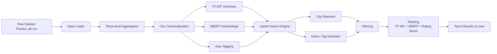

# Indian Tourist Place Recommendation

Hybrid TF-IDF + SBERT place recommender for Indian tourist places.  
Search by natural-language queries (e.g. **"temples in varanasi"** , **"beach in goa"**) and get place-level recommendations with strict city filtering, intent tagging, and confidence-aware ranking.

---

## Table of contents

- [Project overview](#project-overview)
- [Features](#features)
- [Architecture](#architecture)
- [Project structure](#project-structure)
- [Quick start — run locally](#quick-start---run-locally)
- [Prepare data / Notes about dataset](#prepare-data--notes-about-dataset)
- [How it works (short)](#how-it-works-short)
- [CLI demo (screenshot)](#cli-demo-screenshot)
- [Search queries used for screenshots](#search-queries-used-for-screenshots)
- [Development notes & troubleshooting](#development-notes--troubleshooting)
- [Contributing, license & contact](#contributing-license--contact)

---

## Project overview

This repository implements a hybrid search engine that returns **place-level** results for tourist destinations in India. The pipeline combines classic TF-IDF with SBERT semantic embeddings, performs SBERT-based auto-tagging (hill, beach, temple, fort, etc.), and a confidence-aware ranking using `avg_rating × log1p(review_count)` so places with more reviews are favored appropriately.

This project is suitable for a resume/portfolio and easy to extend into a Streamlit or Flask demo later.

---

## Features

- Strict city detection and filtering: when a city is detected in the query, results are **only** returned from that city (no silent all-India fallback).
- Canonical city mapping + fuzzy matching for common misspellings (e.g., `bangalore → bengaluru`, `new delhi → delhi`, `mumabi → mumbai`).
- Hybrid scoring: TF-IDF + SBERT similarity.
- SBERT-based auto-tagging for intent (e.g., `temple`, `beach`, `fort`) and phrase-to-tag mapping for multi-word intents (e.g., `street food → food`).
- Soft tag boosting and optional hard tag filters.
- Ranking boost: `avg_rating × log1p(review_count)` to favour trustworthy places.
- Diagnostics printed for each query (detected_city, detected_tags, city_mask.sum(), candidate_count_after_tag_filter).

---

## Architecture

Mermaid flowchart of the system pipeline:

