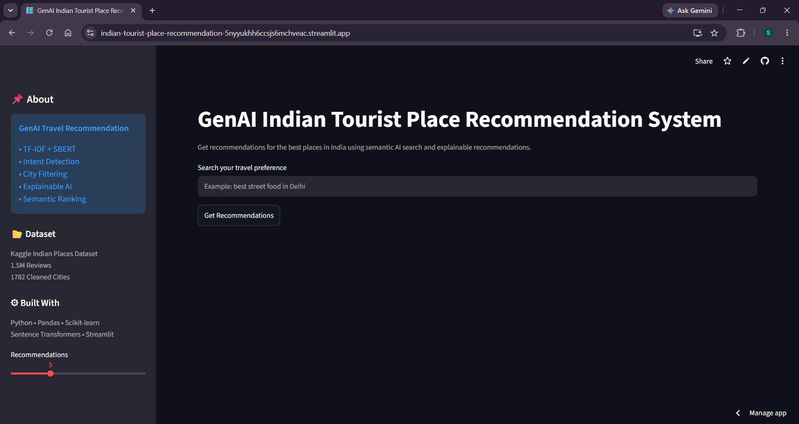
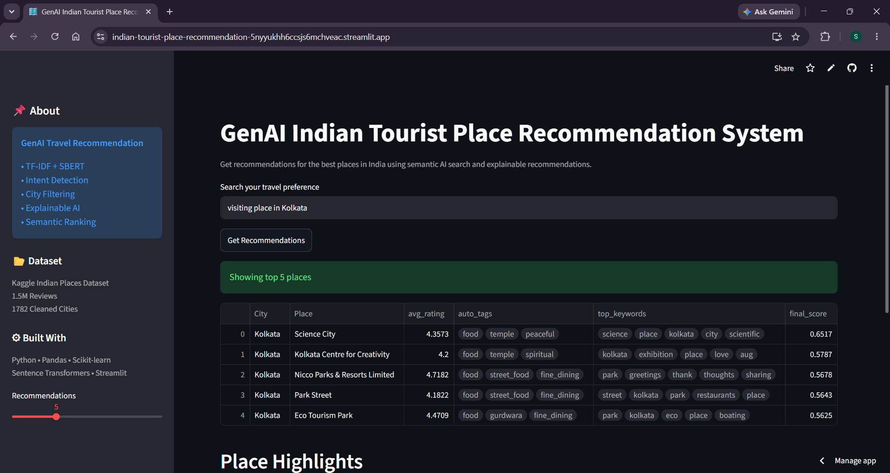
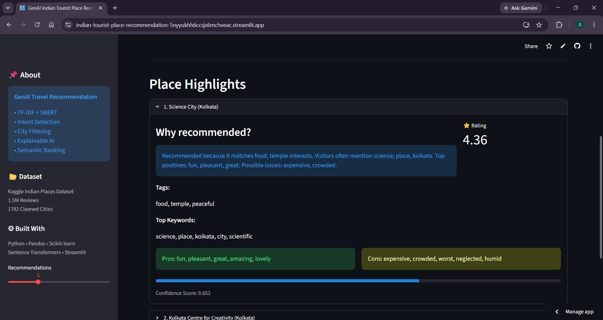

# GenAI Indian Tourist Place Recommendation System

An AI-powered **tourist place recommendation system** that helps users discover the best places to visit in India using **semantic search**, **intent detection**, and **explainable recommendations**.

This project combines **TF-IDF**, **Sentence-BERT (SBERT)**, and intelligent ranking techniques to provide personalized and relevant travel recommendations based on user queries.

---

## Live Demo

**Streamlit App:**
https://indian-tourist-place-recommendation-5nyyukhh6ccsjs6mchveac.streamlit.app/

---

## Features

- Hybrid Search using **TF-IDF + Sentence-BERT**
- Semantic understanding of user queries
- Intent-aware recommendation system
- City-aware strict filtering
- Explainable AI recommendations
- Pros / Cons extraction from reviews
- Confidence-based ranking
- Interactive Streamlit UI
- Expandable place insights

---

## Project Architecture

```text
User Query
   ↓
City Detection
   ↓
Intent Detection
   ↓
TF-IDF Retrieval
   ↓
SBERT Semantic Ranking
   ↓
Tag Boosting
   ↓
Confidence Score Ranking
   ↓
Final Recommendations
   ↓
Explainable Place Insights
```

---

## Tech Stack

- Python
- Pandas
- NumPy
- Scikit-learn
- Sentence Transformers
- Streamlit

---

## Dataset

This project uses the **Kaggle Indian Places to Visit Reviews Dataset**.

Dataset highlights:

- 1.5 Million anonymous reviews
- 1782 cleaned cities
- Real traveler feedback
- Place-level aggregated recommendations

---

## Project Structure

```text
Indian-Tourist-Place-Recommendation/
│── assets/
│   ├── homepage.png
│   ├── recommendation-results.png
│   ├── place-highlights.png
│── data/
│   ├── Review_db.csv
│   ├── places_with_tags.csv
│   ├── places_genai_ready.csv
│── src/
│   ├── data_loader.py
│   ├── tagging.py
│   ├── search_engine.py
│── streamlit_app.py
│── app.py
│── README.md
│── requirements.txt
```

---

## Demo Screenshots

### Homepage



### Recommendation Results



### Place Highlights



---

## Example Queries

- best street food in Delhi
- peaceful beaches in Goa
- family trip places in Kolkata
- forts in Jaipur
- temple in Varanasi

---

## Future Improvements (Phase 2)

- AI itinerary planner
- Budget estimation
- Nearby hotel recommendations
- Best season suggestions
- Route optimization
- Agentic travel planning with Gemini/OpenAI

---

## Author

**Sayan Ghorai**
M.Tech in Artificial Intelligence and Data Science

---
